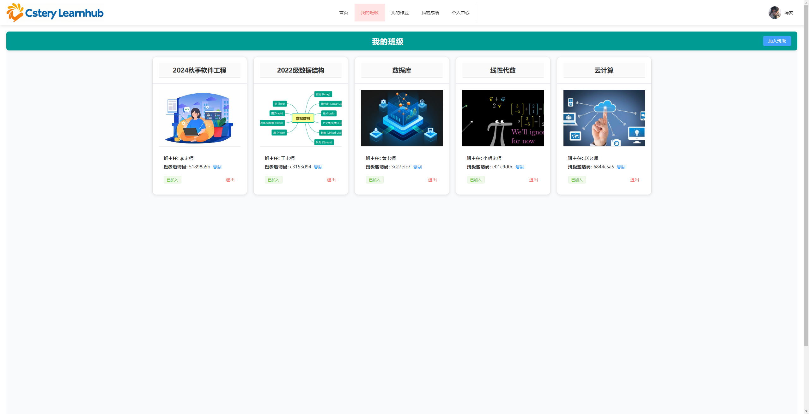
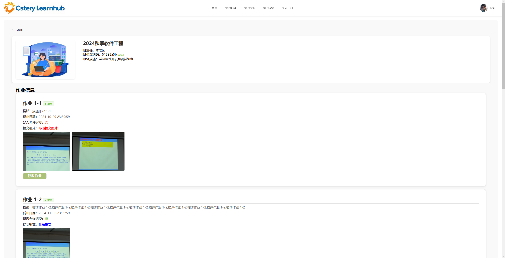
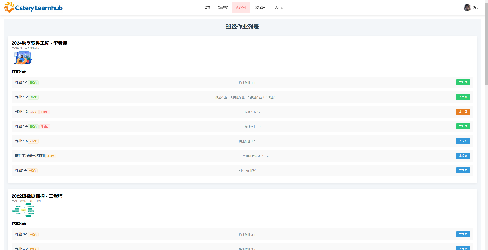
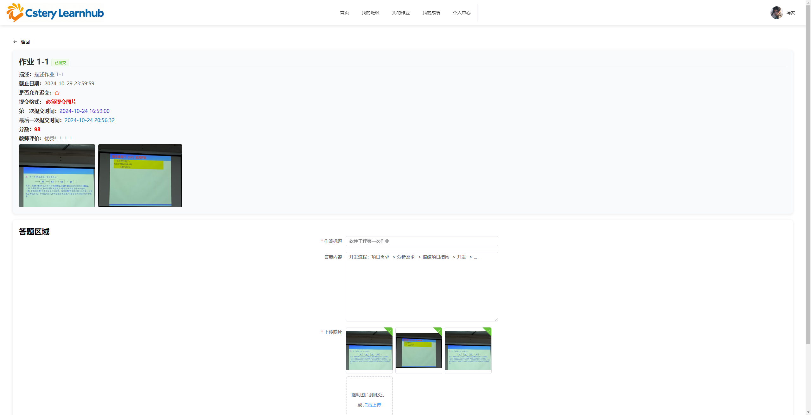
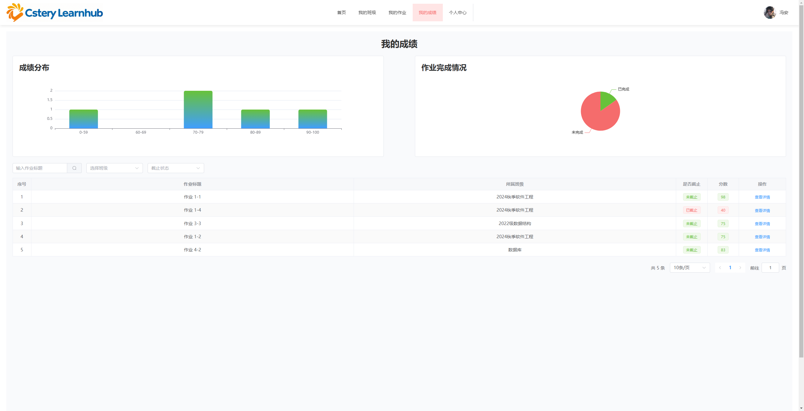
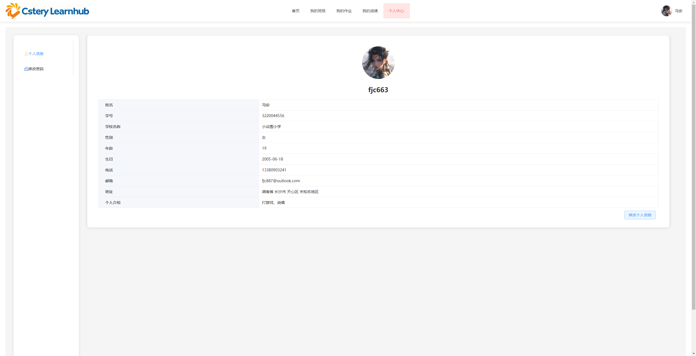
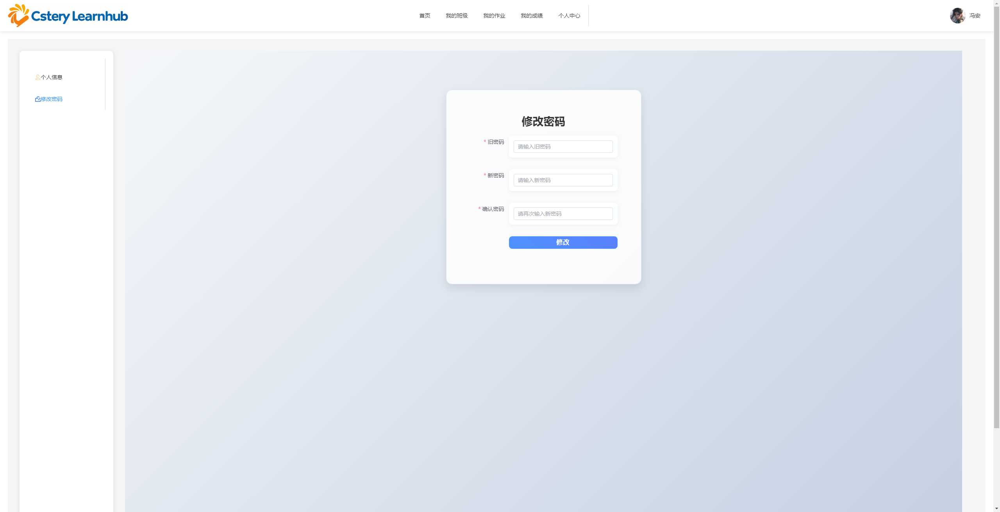

# cstery-learn-hub


欢迎来到 **cstery-learn-hub**，这是一个 **学生端** 的学习平台。

对应的后端项目: [https://github.com/fjc663/cstery-lms-fastapi](https://github.com/fjc663/cstery-lms-fastapi)

---

## 项目概述

简洁直观的平台，用户可以加入班级、完成作业、查看作业批改分数并管理个人账户。

---

## 运行项目

### 安装步骤

1. **克隆仓库**：
   ```bash
   git clone https://github.com/fjc663/cstery-lms-stu.git
   ```

2. **安装依赖**：
   进入项目目录并运行：
   ```bash
   npm install
   ```

3. **运行开发服务器**：
   ```bash
   npm run dev
   ```
   用户端和管理端将在本地运行。端口为5173

4. **访问**

   访问项目: [http://localhost:5173/](http://localhost:5173/)  

---

## 关键页面展示

1. **主页**：

   


2. **我的班级**：

   

   


3. **我的作业**：
   
   
   
   

4. **成绩管理**：

   

5. **个人中心**：
   
   

   
   
6. **视频演示**

   